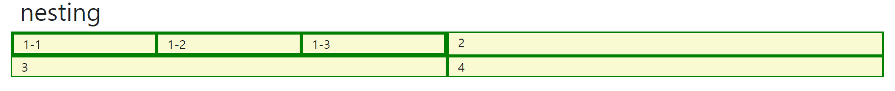
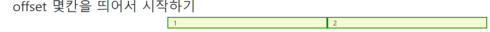

## Bootstrap

#### 소개

> The most popular HTML, CSS, and JS library in the world.

* **HTML, CSS, Javascript 라이브러리**이다.
* 핵심 특징: **Responsive web design** , **Grid System**
* 프론트엔드 개발시 자주 쓰이는 요소(디자인, 테이블, 경고창 등등)에 대해 내장형 모듈로 제공한다.
  * 웹 페이지에서 많이 쓰이는 요소를 거의 전부 내장하고 있다.
  * 고정된 웹페이지가 아닌, 어떤 디바이스로 접속하든, 레이아웃을 적절하게 바꿔주는 것이 내장되어 있다.
  * 디자인시간이 크게 줄고, 여러 웹 브라우저를 지원하는 '크로스 브라우징'에 골머리를 썩일 필요가 없다.
* 웹 브라우저 크기에 따라 자동정렬되는 "**그리드 시스템**"을 지원하며, 이를 통해 *"**one souce multi use**"* 인 
  **반응형 웹 디자인**을 추구한다.
  * 반응형 웹 디자인: 하나의 코드를 통해서 여러 디바이스에서 사용가능한 웹페이지 형태를 만드는것
  * 소스코드 하나에 약간의 설정 코드를 통해 여러 디바이스에서 깨지지 않게 보일 수 있도록 한다.
  * Bootstrap은 그리드 시스템을 통해 반응형 웹 디자인을 구현한다.

<br>

<br>

| **Responsive web design**                                    |
| ------------------------------------------------------------ |
| ● layout은 방문자의 화면 해상도를 고려하여야 한다.<br /><br />● 스마트폰이나 태블릿 등 모바일 기기는 화면이 작기 때문에 가독성에 더욱 신경써야 한다.. <br /><br />● 보통 웹사이트가 축소되어 가로 스크롤 없이 콘텐츠를 볼 수 있으나 글자가 너무 작아지기 때문이다.<br /><br />● 데스크탑용, 테블릿용, 모바일용 웹사이트를 별도 구축할 수도 있지만 One Source Multi Use의 관점에서 올바른 해결책은 아니다.<br /><br />● 반응형 웹 디자인(Responsive Web Design)은 화면 해상도에 따라 가로폭이나 배치를 변경하여 가독성을 높여 이러한 문제를 해결한다.<br /><br />● 즉, 하나의 웹사이트를 구축하여 다양한 디바이스의 화면 해상도에 최적화된 웹사이트를 제공하는 것이다.<br /> |


> 부트스트랩의 경우 기본적으로 사용하는 HTML의 모습과는 달라진다.
>
> ▶ h1의 크기나 글씨체와 같이 부트스트랩만의 특징이 있다.


<br><br>


## 부트스트랩 사용하기

#### 파일을 다운로드 받아서 사용하는 방식

* 부트스트랩을 사용하려면 파일을 다운로드 받아서 우리가 작성하려는 HTML 문서에서 불러와야 한다. 

* 부트스트랩 파일을 받으면 bootstrap.css 와 bootstrap.min.css 파일 등등이 있다. 
  * min 파일은 bootstrap.css와 동일한 내용이지만 한줄로 줄인 버전이다. 
  * min 파일을 통해서 css를 불러올 때 좀 더 속도를 빨리 불러올 수 있다. 
  * 부트스트랩은 이와 같이 여러가지 옵션을 제공한다. 
* 각각의 파일명에 따라 포함된 기능의 범위가 다르다. 
  * 모두 포함하는 것이 bootstrap.css이고 다른 것들은 세부 기능만 포함되어 있다. 
  * 사용자에게 다양한 옵션을 제공한다.(쓸데없는 기능을 안불러올 수 있다)

* 부트스트랩을 다운 받으면 두 개의 폴더가 생성되는데 css와 js다.
  * 이 폴더에서 각각 하나의 css 파일과 하나의 js 파일을 불러오는 것이다. 
  
  * (사용하려는) js파일과 css파일을 html 코드 파일과 동일 경로에 놓고 html 코드에서 불러온다.
  
  * js의 경우 `<body>`안에서 불러온다.
    
    * js의 경우 무조건 body에서 불러오는 것은 아니다. (상황에 따라 head에서 불러올 수도 있다.)
    
      ```html
      <script src="bootstrap.bundle.js"></script>
      ```
    
  * css의 경우 head안에서 불러온다.
  
    ```html
    <link rel="stylesheet" href="bootstrap.css">
    ```


<br>

<br>

#### 부트스트랩을 좀더 편하게 불러오기(사용하기) _ CDN

* 부트스트랩 파일을 받아서 사용하는 것은 일반적인 방식이 아니다.

* 파일을 다운받아서 사용하는 것이 아닌 온라인 상의 주소로 우리가 사용하려는 부트스트랩 파일을 가져온다.

* **Content Delivery(Distribution) Network**
  * 지역적으로 분산된 데이터 센터에 부트스트랩 파일이 저장되어 있고 사용자는 자신과 가까운 곳에서 
    부트스트랩 파일을 가져와 사용한다. 
    
  * 부트스트랩 CSS 파일 가져오는 링크(부트스트랩 사이트의 Doc 참고)
  
    ```HTML
    <link href="https://cdn.jsdelivr.net/npm/bootstrap@5.0.0-beta1/dist/css/bootstrap.min.css" rel="stylesheet" integrity="sha384-giJF6kkoqNQ00vy+HMDP7azOuL0xtbfIcaT9wjKHr8RbDVddVHyTfAAsrekwKmP1" crossorigin="anonymous">
    ```
  
  * 부트스트랩 js 파일을 가져오는 링크(동일 사이트 참고)
  
    ```html
    <script src="https://cdn.jsdelivr.net/npm/bootstrap@5.0.0-beta1/dist/js/bootstrap.bundle.min.js" integrity="sha384-ygbV9kiqUc6oa4msXn9868pTtWMgiQaeYH7/t7LECLbyPA2x65Kgf80OJFdroafW" crossorigin="anonymous"></script>
    ```


<br>

### CSS초기화

* 개발을 해야 할 때는 CSS를 초기화 해주고 시작해야 한다.
* 초기화를 안하는 경우, 웹브라우저에 존재하는 CSS 기본설정이 적용되기에, 개발자가 작성한 디자인과 
  결과물이 차이나게 된다. 
  * 웹브라우저마다 margin, padding등 기본적으로 설정된 값들이 있다.

* CSS를 리셋하는 두 가지 방법
  1. **리셋**: 강하게(무시하는 방식으로)  CSS를 리셋하는 것
  2. **노멀라이즈**: 최근 CSS를 리셋하는 대표적인 방법으로 젠틀하게 CSS를 리셋하는 방식이다. 

* 부트스트랩의 CSS파일에는 CSS를 초기화하는 코드가 들어가 있다.
  * 부트스트랩에서는 노멀라이즈 방식을 커스터마이징한 방식의 초기화 코드를 파일에 넣었다. 
  * (예시) bootstrap.css 파일에 CSS 초기화 코드가 포함되어있다.

<br>


## 부트스트랩의 css 파일에 저장된 수 많은 클래스들

<br>

**css파일을 불러왔다면 이들을 자유롭게 쓸수 있다.**

<br>

#### .mt-1

* **.mt-1**은 {**m**argin-**t**op:0.25rem !important;} 로 구성된 내장 클래스다
* bootstrap.css 코드의 일부로 해당 파일을 불러오면 위와 같은 클래스들을 사용할 수 있다. 
  * -1 = 0.25rem = 4px 
  * -2 = 0.5rem =  8px
  * -3 = 1rem = 16px
  * -4 = 1.5rem = 24px
  * -5 = 3rem = 48px

<br>

#### .mx-0

* {margin-right:0 !important; margin-left:0 !important;}

<br>

#### .mx-auto

* margin의 right와 left를 auto하는 클래스 = 수평 중앙 정렬

<br>

#### .py-0

* padding의 top과 bottom이 0인 클래스 

<br>

#### 스페이싱 기호들

* m = margin

* p = padding

* t = top
* b = bottom
* s = left         >>>>>  *s for start*
* e = right      >>>>>  *e for end*
* x = 좌우(left, right)
* y = 상하(top, bottom)
* 숫자는 0부터 5까지 사용

<br>

#### 백그라운드 컬러

* 부트스트랩을 적용한 빨간색이 기본 빨간색보다 좀 더 현대적이다.
* 부트스트랩은 색의 이름이 기존과 다른다.
  * blue →  .bg-primary
  * red → .bg-danger
  * white  →  .bg-light
  * black  → .bg-dark
  * green  → .bg-success

* 위에서 보면 알겠지만 부트스트랩은 각 컬러들을 **클래스**로 만들어 놨다

<br>

| 색상을 왜 저런 이름으로 작성했을까?                          |
| ------------------------------------------------------------ |
| 색깔이 가지고 있는 의미, 상징에 집중해서 만들었기 때문에 위와 같은 이름이 붙은 것이다. |

<br>

#### 텍스트 컬러

* 텍스트 컬러 역시 클래스로 구현되어 있다.
* 백그라운드 컬러와 클래스 명이 같지만 앞이 bg가 아니라 text가 온다.
* (예시) `.text-primary`

<br>


#### 텍스트 정렬

* 이 역시 클래스로 구현되어 있다. 

* .text-start
* .text-center
* .text-end

<br>

#### 디스플레이 

* 디스플레이 역시 클래스로 구현되어 있다.

* .d-inline
* .d-block

<br>

#### flexbox

* flexbox도 부트스트랩에서 사용가능하다

* `.d-flex justify-content-start`
* 이름은 대부분 비슷하지만 앞에 flex들이 생략된 형태의 클래스로 제공된다.
* self는 자식 요소에 직접 선언을 해야 하는 것도 똑같다

<br>


#### 고정요소(fixed)와 sticky

* `fixed-top`: 화면 상단에 고정시킨다.

* `fixed-bottom`: 화면 하단에 고정시킨다.

* `sticky-top`: 원래는 자기 자리에 있다가, 스크롤을 내려서 해당 요소가 화면 상단에 붙으면 사라지지 않고 계속 화면 상단에 붙어있게 된다.
  * 사용하는 경우: 스크롤을 내려도 따라오는 장바구니 담기 같은 것

<br>

<br>

---

## Grid System의 공식 문서의 예제들을 실제로 해보면서 확인을 해보자★★★★

▶ https://getbootstrap.com/docs/5.0/layout/grid/


<br>

> TIP!
>
> 프로젝트 할 때는 전체 레이아웃은 그리드로 잡고 그 안의 세부적인 부분은 flexbox 속성을 사용하면 좋다. 

<br><br>

## Responsive Web Design

**■ 별도의 특수한 기술이 아닌 반응형 웹 디자인 작성에 도움이 되는 사례들의 모음**    


**■ bootstrap grid system은 이러한 모음 중 하나**    

<br>

<br>

#### Bootstrap Grid System

* 부트스트랩의 grid system 은 container, row ,column을 사용해서 컨텐츠를 레이아웃하고 정렬한다.

  * 부트스트랩의 grid system은 내부적으로 flexbox 시스템으로 작성되어 있다.

  * container를 부모에 선언해주면 그 안의 요소들에게 양쪽에 마진이 조금 생기고 가운데 정렬이 된다. 

  * 다음과 같은 구조로 사용한다.

    - .container > .row > col-*

    <br>

* **grid system의 구성요소 ★**
  
  * **column을 나누는 12개의 칸(구역)**
    * 모바일 우선 flexbox grid 를 사용하여 12개의 column 시스템을 가지고 있다.
    * 3개의 칼럼을 만들면 각각의 칼럼이 알아서 4개의 칸(구역)을 가져간다  → 균등
    * `class="col-숫자"` 를 통해서 해당 칼럼이 몇 칸을 가져갈지 설정해 줄 수 있다.
    * 12칸 초과시 초과 칸들은 아래쪽으로 연결된다.(wrap과 비슷)
  * **6개의 gird breakpoints(계층구조)**
    * 부트스트랩 grid system 은 다양한 디바이스에서 적용하기 위해 특정 px 조건에 대한 지점을 정해 두었는데 이를 breakpoints 라고 한다.
    * 부트스트랩은 대부분의 크기를 정의하기 위해 em 또는 rem 을 사용하지만 그리드  breakpoint에는 px가 사용된다. (뷰포트 너비가 픽셀 단위이고 글꼴 크기에 따라 변하지 않기 때문)

<br>

* 왜 그리드 시스템은 12개의 컬럼을 선택했을까?
  * 적당한 크기의 수 중에서 약수가 많아서
  * 약수가 많다는 것은 그만큼 layout을 다양하게 짤 수 있다는 것이다.

  <br>
  
* 그리드 시스템은 왜 6개의 grid breakpoints를 선택했는가?
  * 6개의 grid breakpoints: xs,sm,md,lg,xl,xxl
  * d-sm-none: = 화면의 크기가 small을 넘어가면 display가 none이 된다.
  * d-md-block: = 화면의 크기가 medium을 넘어가면 display가 block이 된다. 


<br>

<br>

#### grid system 만들기 

* grid로 관리하려는 가장 위쪽의 태그에 "container"라는 클래스를 만든다.
* "container"의 바로 아래 자식은 "row"라는 클래스로 만든다.
  * row 는 columns 의 wrapper 이다.
  * 각 column 에는 공간 사이를 제어하기 위한 좌우 padding 값이 있는데 이를 `gutter` 라고도 한다.
    - row 의 margin 값과 gutter 를 제거하려면 .row 에 `.no-gutters` class 를 사용한다.
* "row"의 자식으로 "col"이라는 클래스
  * `col-숫자` 는 row 당 가능한 12개 중 사용하려는 columns 수를 나타낸다.
  * columns 너비는 백분율로 설정 되므로 항상 부모 요소를 기준으로 유동적으로 크기가 조정된다.
  * grid layout에서 **내용은 반드시 col안**에 있어야 하며 그리고 오직 col 만 row 의 바로 하위 자식 일 수 있다.

<br>

| [TIP] 에멧 사용법   (여러 클래스는 .을 이용해서 연결  &  {$}는 내용 값에 숫자가 1씩 증가해서 부여됨) |
| ------------------------------------------------------------ |
| div.box.col-1{$}*13                                          |

<br>

<br>

#### 그리드 시스템의 가장 큰 장점은 반응형으로 웹페이지 만들수 있다는 것

```html
    <div class="row">
      <div class="box col-2 col-sm-8">1</div>
      <div class="box col-8 col-sm-2">2</div>
      <div class="box col-2 col-sm-2">3</div>
    </div>
```

* 초기에는 1번,3번이 2칸차지하고 2번이 8칸 차지한다.

* 창의 크기가 sm 사이즈를 넘어서게 되면(이상이 되면) 1번이 8칸차지하고 2번,3번이 2칸 차지한다. 

<br>

<br>

#### 중첩된 그리스 시스템

* 칼럼하나를 또 12칸으로 나눠서 그리드로 사용하는 것
* .row > .col-* > .row > .col-* 의 방식으로 중첩 사용 가능하다.


```html
    <h2>nesting</h2>
    <div class="row">
      <div class="box col-6 ">
        <div class="row">
          <div class="box col-4">1-1</div>  /*-4를 생략하면 알아서 균등하게 나눠서 분배*/
          <div class="box col-4">1-2</div>
          <div class="box col-4">1-3</div>
        </div>
      </div>
      <div class="box col-6 ">2</div>
      <div class="box col-6 ">3</div>
      <div class="box col-6 ">4</div>
    </div>
```


**[결과값(출력결과)]**



<br>

<br>

#### offset 속성으로 그리드 컨테이너의 시작점을 조정하기

**offset**

- `offset-*` 은 지정한 만큼의 column 공간을 무시하고 다음 공간부터 컨텐츠를 적용한다.

```html
<h2>offset 몇칸을 띄어서 시작하기</h2>
    <div class="row">
      <div class="box col-4 offset-4">1</div>
      <div class="box col-4">2</div>
    </div>
```




<br><br>

## 그리드 시스템 더 알아보기

<br>

#### 그리드 시스템은 flexbox를 사용해서 만들어졌다.

* 그리드 시스템으로 만든 페이지를 웹페이지에서 개발자도구로 확인해보면 그리드의 container는 display:flex;로 설정되어 있다. 
* row는 flexbox이고 col은 flexitem이 된다.
* 이말인 즉슨, row에 flex의 Property(속성값)를 사용할 수 있다는 것이다.

```html
<div class="parent row justify-content-center align-items-center">
```

* row는 flex의 속성값을 사용할 수 있다.


<br>

| 코드 작성 팁                                           |
| ------------------------------------------------------ |
| Ctrl + Alt를 누르고 화살표를 이동하면 멀티커서가 된다. |

<br>

<br>

#### 그리드 시스템을 사용하는 이유

* 반응형 웹을 구현(6개의 breakpoint를 기준으로 12개의 칸으로 나눔)

* CSS에도 그리드가 있지만 우리가 배운 부트스트랩의 그리드 시스템과는 다르다.

* 우리는 부트스트랩의 그리드 시스템을 사용하고 있다는 것을 잊지말자

<br>

#### ★세 가지만 기억하자

1. `컨테이너` 안에 `로우` 안에 `칼럼`이 있다.

2. 12개의 칼럼 칸(구역)
3. 6개의 브레이크포인트

<br>

<br>

## 최종정리

#### CSS의 레이아웃 방법들

1. position
*  html의 요소들의 상대위치, 고정위치, 절대위치
2. Float
   * 어떤 요소를 텍스트나 인라인 요소를 감싸는 배치 
3. flexbox
   * 요소간의 1차원 정렬기능
4. grid system
   * 강력한 모바일 우선 flexbox 그리드 시스템(12개의 칸, 6개의 반응형 계층)
   * 하나의 웹사이트를 구축해서 다양한 디바이스 화면에 반응하는 Responsive Web page를 구현하기 위함

<br>

#### 각 방법들은 모두 상호보완적이다

* grid system이 나중에 나왔으니까 flexbox보다 좋은 것이 아니다. ▶ 오해하지말자 

* 상황에 따라 다르다
  * 작은 규모를 정렬하는 경우 그리드보다 flexbox가 편할 수도 있다.
  * 전체 페이지를 정렬하는 경우 그리드가 더 편할 것이다.
  * 그리드시스템은 flexbox의 대체제가 아니다. 상황에 따라 적절하게 대체해서 사용해야 한다. 

<br>

> 여러 기술은 각각의 장단점이 존재한다. 
>
> 우리는 어떤 상황에 어떤 기술이 적합한지에 대해 많은 공부와 실습을 통해 배워야 한다. 

