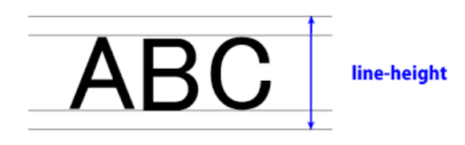

# CSS

> 스타일, 레이아웃 등을 통해 HTML이 사용자에게 어떻게 표시 되는지를 지정하는 언어
>

<br>

## CSS 

<br>

**CSS 구성요소**

- 속성 (Property)
  - 사람이 읽을 수 있는 식별자로, 어떤 (글꼴, 너비, 배경색 등) 스타일 기능을 변경할지 나타냅니다.
- 값 (Value)
  - 각 속성에는 값을 부여한다.
  - 값은 어떻게 (글꼴을 이걸로, 배경 색을 저걸로 등)스타일 기능을 변경할 건지 나타낸다.

<br>

**CSS 정의 방법**

1. `Inline style` 
   * 해당 태그 안에 스타일 값을 직접 넣는 것
2. 내부 참조 (`Embedding style`) 
   * 같은 html 문서내에 `<style> </style>`를 작성해서 사용하는 것
3. 외부 참조 (`Link style`)
   * 외부의 css 파일을 상속받아서 사용하는 것

<br>

---

<br>

## CSS Selector

> 선택자는 스타일을 지정할 웹 페이지의 HTML 요소를 대상으로 하는 데 사용된다.

**클래스(class) 선택자**

- **클래스 선택자는 마침표( .) 문자로 시작** 하며 해당 클래스가 적용된 문서의 모든 항목을 선택한다.
- 태그에 여러개의 클래스를 입력할 때는 `class = "클래스명1 클래스명2 클래스명3 ..."` 형태로 작성한다.
  - 클래스명들 사이에는 **공백 한칸으로 구분**한다. (※컴마`,`를 쓰면 안된다.)

<br>

**아이디(id) 선택자**

- 아이디 선택자는 `#` 문자로 시작하며 기본적으로 클래스 선택자와 같은 방식으로 사용한다.
- 그러나 아이디는 문서 당 한 번만 사용할 수 있으며 요소에는 단일 id값만 적용 할 수 있다
- **문서에서 동일한 아이디를 여러 번 사용해도 동작하나 그렇게 하면 안된다.**

<br>

**결합자**(combinators)

- 자손 결합자
  - **셀렉터A  ` `(공백) 셀렉터B**
  - 셀렉터A의 모든 후손 요소(level n) 중 셀렉터B와 일치하는 요소 선택
- 자식 결합자
  - **셀렉터A `>` 셀렉터B**
  - 셀렉터A의 모든 자식 요소(level 1) 중 셀렉터B와 일치하는 요소 선택
- 일반 형제 결합자
  - **셀렉터A `~` 셀렉터B**
  - 셀렉터A의 형제 요소 중 셀렉터A 뒤에 위치하는 셀렉터B 요소를 모두 선택
- 인접 형제 결합자
  - **셀렉터A `+` 셀렉터B**
  - 셀렉터A의 형제 요소 중 셀렉터A 바로 뒤에 위치하는 셀렉터B 요소를 선택
  - 단, A와 B 사이에 다른 요소가 존재하면 선택되지 않음

<br>

**착각하기 쉬운 CSS 규칙들**

1. 자식 요소 Property는 부모의 Property를 모두 상속 받지 않는다
   * 상속이 되는 Property가 있고, 상속이 안되는 Property가 있다. 
   * 상속이 안되는 Property를 상속시키려면 `inherit` 키워드를 사용해서 명시적으로 상속시킬 수 있다.

2. 디바이스마다 화면의 크기가 다른 것을 고려하여 vp(Viewport)단위를 사용한다.

3. `img`태그의 `alt`특성은 이미지의 텍스트 설명으로 이미지가 로딩이 안되는 경우 보여주는 텍스트다.    

<br>


**적용 우선순위**

1. `!important`
   - 다른 사람들의 코드에서 발견할 때 그 의미를 알 수 있는 것은 좋다.
   - 하지만 반드시 필요한 경우가 아니면 절대 사용하지 않는 것이 좋다.,
   - `!important` 는 cascading이 정상적으로 작동하는 방식을 변경하므로, CSS 스타일 문제를 해결하기가 어렵습니다.
2. `inline style`
3. `id 선택자`
   - id는 대부분의 다른 선택자보다 우선순위가 높기 때문에 다루기가 어려워 질 수 있다.
   - 대부분의 경우 id 보다는 모두  class 선택자로 작성하는 것이 좋다.
   - 만약 문서 내 `링크 이동`이나 `for`를 사용하는 특별한 경우에만 아이디를 사용한다.
4. `class 선택자`
5. `요소 선택자`
6. `소스 코드 작성 순서`

<br>

---

<br>

## CSS 단위

**(상대) 크기 단위**

**px**

- 모니터 해상도의 한 화소인 '픽셀'을 기준
- 픽셀의 크기는 변하지 않기 때문에 **고정적인 단위**

**%**

- 레이아웃(margin 안쪽의 영역)을 기준으로 하는 백분율 단위
- **가변적인 레이아웃에서 자주 사용**

**em**

- em은 상속의 영향 받는다  ▶ 상속받는 상위 태그의 단위를 기준으로 1.5배 한다.
- 따라서 상황에 따라 각기 다른 값을 가질 수 있다.

**rem**

- 최상위 요소인 html(root em)을  절대 단위를 기준으로 삼기에 상속의 영향을 받지 않는다.
- 상속에 영향을 받지 않기 때문에 대부분의 경우 `rem` 을 많이 사용한다.

**viewport**

- 다양한 디바이스로 웹 페이지를 방문한 유저에게 현재 보이는 웹 컨텐츠의 영역크기(vp)를 기준으로 한다.
- viewport(=vp)를 기준으로한 상대적인 사이즈다.
- 주로 스마트폰이나 테블릿 디바이스의 화면을 일컫는 용어로 사용된다.
- vw, vh

<br>

**색상 표현 단위**

1. 색상 키워드
   - 색상 키워드는 대소문자를 구분하지 않는 식별자로, red, blue, black처럼 특정 색을 나타낸다
2. RGB 색상
   - 빨강, 초록, 파랑을 통해 특정 색을 표현
   - 16진수 표기법이나 함수형 표기법으로 사용
   - a는 alpha(투명도)가 추가된 것
3. HSL 색상
   - 색상, 채도, 명도를 통해 특정 색상을 표현
   - a는 alpha(투명도)가 추가된 것

<br>

---

<br>

## Box Model

> 웹 디자인은 contents를 담을 box model을 정의하고 CSS 속성을 통해 스타일(배경, 폰트와 텍스트 등)과 위치 및 정렬을 지정하는 것.

<br>

**모든 HTML 요소는 box 형태로 되어있다.**

**하나의 박스는 네 부분(영역)으로 이루어 진다.**

- content / padding / border / margin

<br>

1. **Content**
   - 글이나 이미지, 비디오 등 요소의 실제 내용
2. **Padding (안쪽 여백)**
   - Border(테두리) 안쪽의 내부 여백
   - 배경색, 이미지 지정 가능
3. **Border**
4. **Margin (바깥쪽 여백)**
   - 테두리 바깥의 외부 여백
   - 배경색 지정 불가

<br>

**마진 상쇄**

- block의 top 및 bottom margin이 때로는 (결합되는 마진 중 크기가) 가장 큰 한 마진으로 결합(combine, 상쇄(collapsed))된다.

<br>

---

<br>

## Display

> display CSS 속성은 요소를 블록과 인라인 요소 중 어느 쪽으로 처리할지와 함께 자식 요소를 배치할 때 사용할 레이아웃을 설정한다.

**block**

- 한 줄을 모두 차지하는 박스를 의미한다.
  - block은 (줄을 모두 차지하는) 블록 상자를 생성하여 요소 앞뒤에 줄 바꿈을 발생시킨다.
- **블록 레벨 요소안에 인라인 레벨 요소가 들어갈 수 있다.**

<br>

**inline**

- 한 줄의 공간 중 일부에 들어간 세입자와 같은 존재를 의미한다.
  - 줄바꿈이 일어나지 않는 행의 일부 요소
- content 너비만큼 가로 폭을 차지한다. 
- width, height, margin-top, margin-bottom을 지정할 수 없다.(상하에 대해서는 권한 없다)
- 상하 여백은 자신의 크기(줄의 높이)인 `line-height` 밖에 지정할 방법이 없다.

<br>

**inline-block**

- inline 처럼 텍스트 흐름대로 나열된다.
- block처럼 박스 형태이기 block 속성을 사용할 수 있다. 

<br>

**none**

- 해당 요소를 화면에서 사라지게 하며 **요소의 공간조차 사라지게 한다.** (완전 소멸)
- `visibility: hidden;`은 해당 요소를 화면에서 사라지게는 하나 공간은 사라지지 않는다.

<br>

<br>

## Position

**기본 내용**

* 문서 상에서 **요소를 배치하는 방법**을 지정한다.
* 모든 요소는 기본적으로 위치하는 **디폴트 값**이 있고 이 디폴트 값을 `static`이라고 부른다.
  * `positon`속성이 설정되어 있지 않는 요소는 모두 `static`이다.
  * `postion`속성의 값으로는 `relative` , `absolute` , `fixed` 등이 있다.

- position
  - static / absolute / relative / fixed
  - z-index

<br>

**기본 개념**

1. **static (기본 위치)**
   
   - 모든 태그의 기본
   
   - 태그의 default 값
   
     <br>
   
2. **relative (상대 위치)**
   
   - 해당 요소가 원래 있어야 하는 위치(`static` 위치)를 기준으로 이동하는 것(처럼 보이는 것)
   
     * 이동하는 게 아니고 이동하는 것처럼 보이는 것이다
     * 내가 이동을 하더라도 원래 자리에 나는 존재한다(보이지 않을 뿐 존재감은 존재)
   
   - 나를 기준으로 이동한다 (`absolute`의 경우 부모를 기준으로 이동한다)
   
     <br>
   
3. **absolute (절대 위치)**

   - `static`이 아닌, 가장 가까이 있는 부모를 기준으로  절대적으로 이동한다.
     * 위의 부모들이 모두 `static`인 경우(=`position`값이 지정되지 않은 경우) `body`까지 올라간다.
       (`body`는 모든 본문 요소의 조상(부모))
     * (cf_`body`는 `static`이지만 `absolute`가 `non-static` 부모를 못찾는 경우 기준점으로 작동한다.)
   - 내가 이동을 하면 원래 자리는 빈 공간이 된다.(존재감 없는 빈 공간이 됨 == 다른 요소가 들어올 수  있다)
     - `absolute`는 원래 위치해 있었던 과거 위치에 있던 공간은 더 이상 존재하지 않는다는 점이 특징이다.
   - 어디로 이동하던지, 기존의 요소에 영향을 주지 않는다.
     * 따라서 팝업창과 같은 것을 작성해야 할 때, `absolute`를 사용한다.
     * 페이지의 다른 요소의 위치와 간섭하지 않는 격리된 사용자 인터페이스 기능을 만들 수 있다.
     * 팝업 정보 상자 및 제어 메뉴, 롤오버 패널, 페이지 어느 곳에서나 끌어서 놓기할 수 있는 유저 인터페이스 페이지 등

   <br>

4. **fixed (고정 위치)**
   
   - 부모/조상 요소와 관계없이 브라우저의 viewport를 기준으로 좌표 속성 만큼 이동
   - 무조건 고정된 기준 위치를 정해주는 것으로 스크롤을 내려도 해당 위치에 고정되어 있다.
   - 쇼핑몰 사이트에 가면 Top과 같은 버튼은 스크롤을 내려도 위치가 고정되어 있다.

<br>

**z축**

* html이라는 평면 위에 수직으로 있는 축 개념으로, 어떤 요소가 아래에 있는지 위에 있는지에 대한 개념이다.
* `z-index`라는 속성을 통해 요소들의 z축 우선순위를 나타낼 수 있다. 
  * `z-index` 값이 높을 수록 우선순위가 높다.
* `z-index`는 `static`이 아닌 요소들에 대해서만 작동을 한다.

* (`z-index`가 설정되어 있지 않다면) 일반적으로는 먼저 생성된 것이 더 우선순위가 높게 나타난다. 

<br>

## 기타

#### style의 속성 중 height와  line-height의 차이

**1. line-height**

* 글자가 한 줄에서 차지하는 높이(줄높이)



* 위 글자의 상하에 위치한 여백 공간이 있는데, 그 여백 공간을 **leading** 영역이라고 한다.
* `line-height`는 **leading** 공간의 높이를 조절하는 속성값이다.

**2. height**

* 해당 태그 상자의 높이 값을 정해주는 것이다. 

<br>

#### emmet(에멧)_자동완성기능

* `div.class` 하고 `tab`을 누르면 `"class"`라는 `class`를 가진 `div `하나를 자동 생성해준다.
* `div#id`를 하고 `tab`을 누르면 `"id"`라는 `id`를 가진 `div`하나 생성해준다.
* `div*2`를 하고 `tab`을 누르면 2개의 `div`를 만들어준다. 
* `div>a`를 하고 `tab`을 누르면 `div` 태그 하나를 만들고 그 안에 `a`태그를 만들어준다.
* `ol>li*3`을 하고 `tab`을 누르면 `ol`태그 하나를 만들고 그 안에 `li` 태그 3개를 만들어준다.

* 태그의 내용(값)으로 `lorem`을 입력하면 더미 값을 입력해준다. 
  * `lorem숫자` 를 입력하면 숫자 갯수의 더미 문자열을 입력해준다. 
  * (예시: `<li>lorem2</li>`)

<br>

### css에서도 함수를 작성해서 요소를 동적으로 움직이게 할 수 도 있다. 

* `@keyframes <명령어>`를 통해서 함수 작성이 가능하고, style의 속성 값인 `animation-name`에 해당 함수 
  이름을 넣어주면 해당 함수가 작동한다. 

* 하지만 실제로는 이렇게 직접 작성하는 것보다 외부의 라이브러리를 사용해서 작성하는게 좋다.
  (Animate.css와 같은 라이브러리가 대표적)

<br><br>

## 실제 코드 구현시 어려웠던 부분

#### padding안에 이미지를 100%로 채우는 방법

* 이미지를 contents 영역을 가득 채우도록 하는 방법

  ```html
  <style>
      .card-header{
          padding:18px;
      }
  
      .card-img{
          display:block;
          width:100%;
          height:330px;
      }
  </style>
  ```

* 위 코드는 이미지가 가지고 있는 파란색 부분을 가득 채우게 한다. 

* 이미지는 글자처럼 취급이 된다. 

  * 글자들은 아래로 튀어나오는 부분을 위해 아래 여백이 자동적으로 할당된다. 
  * 이것들을 없애기 위해서는 그림을 block으로 취급해주는 코드를 넣어준다.
  * `display: block`

<br>

#### 블록안에 텍스트를 가운데 높이 정렬하는 방법 (수평으로는 맞췄는데 수직으로는 못맞춤)

* text-align: center; 로 수평 정렬을 할 수 있다.
* 총 두 줄이 존재한다. 두 줄의 높이가 전체 상자 높이인 70px이 되도록 맞춰주면 된다. 
* 따라서 `line-height:35px;`로 설정한다. (`line-height`는 텍스트 한줄이 가지는 높이 속성)

<br>

#### 놓친 것들

* **전체 페이지를 기준으로 가장 큰 덩어리가 어떻게 정렬되어 있는지 파악**한다.

  * 가장 큰 덩어리부터 style을 작성한다.

    <br>

* 기본적으로 문제에 특정 태그의 스타일 옵션을 주라는 내용이 있으면 가장 먼저 수행한다.

  * font를 바꾸기 위해서는 `font-family` 속성을 사용한다.

    <br>

* 각 기능을 하나하나의 개별적인 `class`로 구현해서 관리해준다.

  <br>

* `margin:auto;`
  * 지금 내가 보고 있는 영역의 좌우 `margin`을 컴퓨터가 알아서 동일하게 설정해서 해당 태그를 가운데 정렬해주는 것.
  * 화면의 크기를 늘려도 가운데 유지가 되는 것이 장점.
  * `margin-left:auto;`는 **왼쪽에 가능한 큰 마진을 준다는 뜻**으로 내용(텍스트)는 오른쪽으로 정렬된다.

<br>

* 컨텐츠 주변의 여백은 `margin`이 아닌 `padding`을 활용하자.
  * `padding`을 써야  `width:100%;`를 사용했을 때, `padding` 안쪽 영역(content)을 가득 채우게 된다. 

<br>

* h4태그와 p태그는 모두 block 속성으로 한 줄을 차지한다. → 이들을 같은 줄에 넣기 위해서는 inline요소로 바꿔줘야 한다. 
  * `display:inline;`

<br>

* inline의 속성
  * inline은 `margin-top`, `margin-bottom`을 설정할 수 없다.(좌우 마진만 가능)
  * block은 해당 줄의 주인이지만 inline은 세입자와 같기에 층간소음에 대해 뭐라 할 처지가 아니다. 

<br>

#### css 작성요령

* 배경 색과 같은 것은 클래스로 만들어서 적용시킨다. 
  * `.bg-white` 혹은 `.bg-lightgray`와 같이 클래스를 만들어서 이 후 변경사항이 생기더라도 클래스 이름만 바꿔주면 바뀌도록 작성한다. 
* 마진이나 패딩 역시 하나의 클래스로 만들어서 작성한다.
  * `.m-4{margin:4px;}` → 마진이 4px인 클래스 
  * `.p-4{padding:4px;}` → 패딩이 4px인 클래스
* 텍스트 가운데 정렬 역시 하나의 클래스로 만들어준다.

  * `.text-center{text-align :center;}`
* 인라인 블록으로 만드는 것도 클래스로 만든다.

  * `.d-inline-block{display:inline-block;}`
* 만들기 전에는 항상 `<body>`가 어떻게 구성되어 있는지 확인한다

  * 접히는 기능을 통해서 `<body>`밑에 어떤 요소로 크게 구분되어 있는지 확인한다. 

<br>

## 참고문헌

https://developer.mozilla.org/en-US/docs/Web/CSS/CSS_Selectors

https://developer.mozilla.org/ko/docs/Learn/CSS/Building_blocks/Cascade_and_inheritance

https://developer.mozilla.org/ko/docs/Web/CSS/inheritance

https://developer.mozilla.org/ko/docs/Web/HTML/Block-level_elements

https://developer.mozilla.org/ko/docs/Web/HTML/Inline_elements

https://developer.mozilla.org/ko/docs/Web/CSS/display

https://docs.emmet.io/cheat-sheet/ 