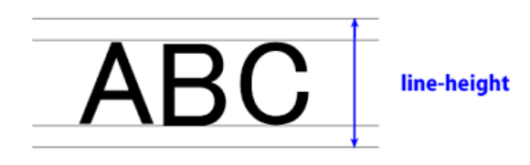

## CSS

#### 착각하기 쉬운 CSS 규칙들

1. 자식 요소 Property는 부모의 Property를 모두 상속 받지 않는다
   * 상속이 되는 Property가 있고, 상속이 안되는 Property가 있다. 
   * 상속이 안되는 Property를 상속시키려면 `inherit` 키워드를 사용해서 명시적으로 상속시킬 수 있다.

2. 디바이스마다 화면의 크기가 다른 것을 고려하여 vp(Viewport)단위를 사용한다.

3. `img`태그의 `alt`특성은 이미지의 텍스트 설명으로 이미지가 로딩이 안되는 경우 보여주는 텍스트다.    

   

### CSS position

* 문서 상에서 **요소를 배치하는 방법**을 지정한다.

* 모든 요소는 기본적으로 위치하는 **디폴트 값**이 있고 이 디폴트 값을 `static`이라고 부른다.
  * `positon`속성이 설정되어 있지 않는 요소는 모두 `static`이다.
  * `postion`속성의 값으로는 `relative` , `absolute` , `fixed` 등이 있다.

* **relative**

  * 해당 요소가 원래 있어야 하는 위치(`static` 위치)를 기준으로 이동하는 것(처럼 보이는 것)

    * 이동하는 게 아니고 이동하는 것처럼 보이는 것이다
    * 내가 이동을 하더라도 원래 자리에 나는 존재한다(보이지 않을 뿐 존재감은 존재)

  * 나를 기준으로 이동한다 (`absolute`의 경우 부모를 기준으로 이동한다)

    

* **absolute**

  * `static`이 아닌, 가장 가까이 있는 부모를 기준으로  절대적으로 이동한다.
    * 위의 부모들이 모두 `static`인 경우(=`position`값이 지정되지 않은 경우) `body`까지 올라간다.
      (`body`는 모든 본문 요소의 조상(부모))
    * (cf_`body`는 `static`이지만 `absolute`가 `non-static` 부모를 못찾는 경우 기준점으로 작동한다.)
  * 부모요소를 기준으로 이동한다.
  * 내가 이동을 하면 원래 자리는 빈 공간이 된다.(존재감 없는 빈 공간이 됨 == 다른 요소가 들어올 수  있다)
  * 어디로 이동하던지, 기존의 요소에 영향을 주지 않는다.
    * 따라서 팝업창과 같은 것을 작성해야 할 때, `absolute`를 사용한다.

* **fixed**

  * 무조건 고정된 기준 위치를 정해주는 것으로 스크롤을 내려도 해당 위치에 고정되어 있다.
  * 쇼핑몰 사이트에 가면 Top과 같은 버튼은 스크롤을 내려도 위치가 고정되어 있다.

​     

> fixed는 기준없이 화면의 특정 위치에 고정되어 있는 것이고 relative와 absolute는 어떤 기준점을 기준으로 위치가 이동하는 것(or 이동하는 것처럼 보이는 것)이다. 

​     

​     

### z축

* html이라는 평면 위에 수직으로 있는 축 개념으로, 어떤 요소가 아래에 있는지 위에 있는지에 대한 개념이다.
* `z-index`라는 속성을 통해 요소들의 z축 우선순위를 나타낼 수 있다. 
  * `z-index` 값이 높을 수록 우선순위가 높다.
* `z-index`는 `static`이 아닌 요소들에 대해서만 작동을 한다.

* (`z-index`가 설정되어 있지 않다면) 일반적으로는 먼저 생성된 것이 더 우선순위가 높게 나타난다. 

​     

### style의 속성 중 height와  line-height의 차이

#### 1. line-height

* 글자가 한 줄에서 차지하는 높이(줄높이)

* 위 글자의 상하에 위치한 여백 공간이 있는데, 그 여백 공간을 **leading** 영역이라고 한다.
* `line-height`는 **leading** 공간의 높이를 조절하는 속성값이다.

#### 2. height

* 해당 태그 상자의 높이 값을 정해주는 것이다. 

### emmet(에멧)_자동완성기능

* `div.class` 하고 `tab`을 누르면 `"class"`라는 `class`를 가진 `div `하나를 자동 생성해준다.
* `div#id`를 하고 `tab`을 누르면 `"id"`라는 `id`를 가진 `div`하나 생성해준다.
* `div*2`를 하고 `tab`을 누르면 2개의 `div`를 만들어준다. 
* `div>a`를 하고 `tab`을 누르면 `div` 태그 하나를 만들고 그 안에 `a`태그를 만들어준다.
* `ol>li*3`을 하고 `tab`을 누르면 `ol`태그 하나를 만들고 그 안에 `li` 태그 3개를 만들어준다.

* 태그의 내용(값)으로 `lorem`을 입력하면 더미 값을 입력해준다. 
  * `lorem숫자` 를 입력하면 숫자 갯수의 더미 문자열을 입력해준다. 
  * (예시: `<li>lorem2</li>`)

​     

### css에서도 함수를 작성해서 요소를 동적으로 움직이게 할 수 도 있다. 

* `@keyframes <명령어>`를 통해서 함수 작성이 가능하고, style의 속성 값인 `animation-name`에 해당 함수 
  이름을 넣어주면 해당 함수가 작동한다. 

* 하지만 실제로는 이렇게 직접 작성하는 것보다 외부의 라이브러리를 사용해서 작성하는게 좋다.
  (Animate.css와 같은 라이브러리가 대표적)

