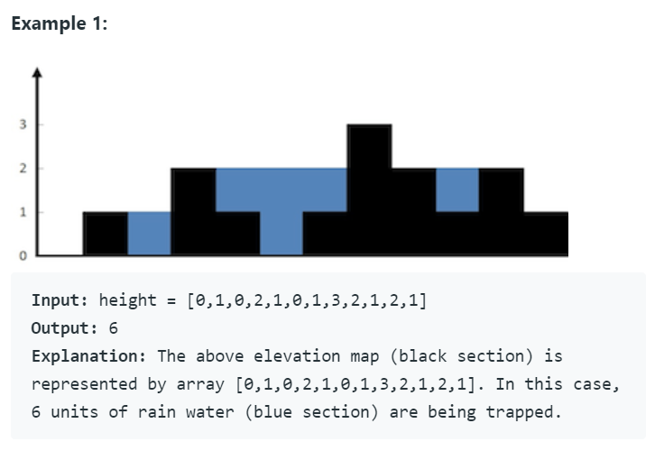

### 빗물 트래핑

출처: https://leetcode.com/problems/trapping-rain-water


> 문제

높이를 입력받아 비 온 후 얼마나 많은 물이 쌓일 수 있는지 계산하라.


> 입력값




> 코드_ 투포인터이용

```python
class Solution:
    def trap(self, height: List[int]) -> int:
        # 빈 리스트는 0 반환
        if not height:
            return 0
        
        # left, right 포인터 생성
        left,right = 0,len(height)-1
        # 결과값 담을 변수(volume)생성
        volume = 0
        # 왼쪽, 오른쪽 최대 높이 담을 변수 생성
        max_left, max_right = height[left],height[right]
        
        # 모든 항목의 순회가 끝날 때 까지 순회
        while left < right:
            # 현재 포인터 단계에서 왼쪽, 오른쪽 최대 높이 구함
            max_left = max(max_left, height[left])
            max_right = max(max_right, height[right])
            
            # 오른쪽이 더 높은 경우, 왼쪽 부분 물의 양만큼 더해줌
            if max_left<max_right:
                volume += max_left - height[left]
                left += 1
            else:
                volume += max_right - height[right]
                right -= 1
                
        return volume
```

​    

> 코드설명

* 한번의 순회로 푸는 방법을 찾기 위해서 **투 포인터 방식**을 사용했다.
* 생각을 해보면, 왼쪽과 오른쪽은 결국 하나의 그릇을 만들게 되어 있다. 
* 따라서 둘 중 조금이라도 낮은 쪽에서 높이차만큼 물을 담으며 앞으로 한칸씩 이동이 가능하다.
* 위 코드 역시 이러한 방식으로 작성되었다.


> 코드_스택쌓기

```python
class Solution:
    def trap(self, height: list)
        stack = []
        volume = 0

        for i in range(len(height)):
            # 변곡점을 만나는 경우
            while stack and height[i] > height[stack[-1]]:
                # 스택에서 꺼낸다
                top = stack.pop()

                if not len(stack):
                    break

                # 이전과의 차이만큼 물 높이 처리
                distance = i - stack[-1] - 1
                waters = min(height[i], height[stack[-1]]) - height[top]

                volume += distance * waters

            stack.append(i)
        return volume
```

​    

> 코드설명

* 직관적으로는 이해하기 어렵다
* 일단 직전보다 높이가 높은 경우,  그릇이라 생각해서 양쪽 높이 중 낮은 쪽을 기준으로 물 부피를 구한다.
  * 직전보다 높이가 낮거나 같은 경우는 계속 더해준다.


