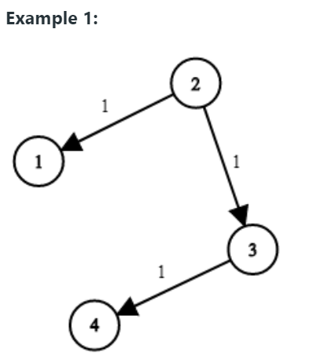

## 네트워크 딜레이 타임 _ 다익스트라 알고리즘

출처: https://leetcode.com/problems/network-delay-time/

​    

> 문제

K부터 출발하여 모든 노드가 신호를 받을 수 있는 최소 시간을 계산하라.

모든 노드가 신호를 받는 것이 불가능한 경우 -1을 반환한다.

입력값 (u,v,w)는 각각 출발지, 도착지, 소요시간으로 구성되고 전체 노드의 갯수는 n으로 입력받는다.   


> 입력과 출력




```
# Example 1
Input: times = [[2,1,1],[2,3,1],[3,4,1]], n = 4, k = 2
Output: 2
```

```
# Example 2
Input: times = [[1,2,1]], n = 2, k = 1
Output: 1
```

```
# Example 3
Input: times = [[1,2,1]], n = 2, k = 2
Output: -1
```

​    

> 생각

* 이 문제에서 해결해야 하는 두 가지
  1. 모든 노드가 신호를 받는데 걸리는 시간
     * `{노드: 최소시간}`의 형태로 결과값을 업데이트하고 마지막에 `.values()`를 쓴 객체에 `max`를 출력
  2. 모든 노드가 신호를 받을 수 있는지
     * `{노드: 최소시간}`의 길이(=`key`값의 갯수)가 `n`개인지 확인


※ 이 문제에서 배워야 하는 것 가운데 가장 중요한 것은 바로 위에 나온 **최단거리를 담는 딕셔너리 생성**하는 것

▶ 최단거리 딕셔너리를 통해 최단거리는 물론 방문한 노드 갯수까지 알 수 있다. 


> 코드 _ 다익스트라 알고리즘

```python
from collections import defaultdict
import heapq

class Solution:
    def networkDelayTime(self, times: List[List[int]], n: int, k: int) -> int:
        #1   그래프 생성
        graph = defaultdict(list)
        for d,a,c in times:
            graph[d].append((a,c))
        
        #2   노드별 최소 거리값 담을 딕셔너리 생성
        dist = defaultdict(int)

        q = []
        heapq.heappush(q,(0,k))
        
        # ★
        # dist[k] = 0
        
        # 3   while문 돌면서 방문한적없다면 최소거리값 업데이트, 연결 노드를 heapq에 추가
        while q:
            cost, node = heapq.heappop(q)
            # ★ 여기서 if dist.get(nodet):를 하면 안되는 이유
            # 최초의 시작점은 dist[node]가 0으로 들어간다.
            # 따라서 위의 코드로 작성하는 경우
            # 최초의 시작점이 이후에 다시 호출된다면 값이 아직 없는 것으로 나온다.
            if node not in dist:
                dist[node] = cost
                for next_node,next_cost in graph[node]:
                    heapq.heappush(q,(next_cost+cost,next_node))
                    
        # 4    방문한 노드의 갯수를 확인(모두 방문했는지 확인)
        if len(dist) == n:
            return max(dist.values())
        return -1
```

​    

> 코드 설명

* **#1**
  * 그래프 생성 단계
* **#2**
  * 거리값 저장 할 `dist` 생성(`defaultdict`을 통해서 만들었지만 사실 그냥 `dict`으로 만들어도 된다.)
    * `dist`는 `{노드: 거리값}`의 형태로 작성한다.
  * `q`를 만들고 초기값`(시작노드:0(거리값))`을 넣어준다.
* **#★**
  * `dist` 생성시 습관적으로 `{시작노드 : 0(거리)}`를 넣었는데, 그 결과 입력값과 상관없이 `while`문이 
    제대로 작동하지 않았다.
  * (`while`문을 보면) 매번 `heappop` 으로 뽑은 노드가 이전에 `dist`에 등록된 적이 없는 경우에만 
    (`dist`에 등록을 하고) 연결 노드들을 탐색한다. 
  * 따라서 시작노드값을 미리 `dist`에 넣어놓는 경우 시작노드와 연결된 노드들에 대한 탐색이 진행되지 
    않는다.
  * ★ `while`문의 **작동 구조에 주의**해야 한다. 
    ▷ `while`문에서 해당 번째의 `node`는 <u>미지의 대상</u>인지, <u>이미 판단이 끝난 대상</u>인지 살펴봐야한다.
    ▷ <u>미지의 대상</u>인 경우 어떤 검증과정을 거쳐 등록이 되고 다음번으로 넘어가는지 이해하자.
* **#3**
  * `heapq.heappop()`를 통해 현재 가장 거리값이 작은 노드와 거리를 추출한다(데이터 순서 주의)
  * `if node not in dist:`를 통해 현재 뽑은 노드가 거리값 측정이 끝난 노드인지 아닌지 확인
  * 거리값 측정이 끝나지 않은 노드라면, `dist[node] = cost`를 통해 거리값 등록
  * `graph[node]`를 순회하면서 `q`에 `(연결노드의 거리값 + 현재노드(부모노드)의 거리값, 노드번호)`를 
    추가한다. 
* **#4**
  * 순회가 모두 종료된 경우, `dist`의 `key` 갯수와 `n`을 비교해서 같다면 (=모두 순회가 되었다면), 
    가장 큰 거리값을 반환한다. (아니라면 `-1`을 반환)
  * `dictionary` 이름은 기본적으로 `key` 목록을 의미한다.