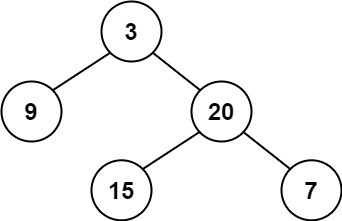

## 균형이진트리

출처: https://leetcode.com/problems/balanced-binary-tree    


> 문제

이진트리가 높이 균형(Height-Balanced)인지 판단하라.

(높이 균형: 모든 노드의 서브 트리 간의 높이차이가 1 이하인 것을 말한다)    


> 입력과 출력



```
Input: root = [3,9,20,null,null,15,7]
Output: true
```

​    


```
Input: root = [1,2,2,3,3,null,null,4,4]
Output: false
```

​    

> 생각


> 코드_재귀

```python
# Definition for a binary tree node.
# class TreeNode:
#     def __init__(self, val=0, left=None, right=None):
#         self.val = val
#         self.left = left
#         self.right = right
class Solution:
    def isBalanced(self, root: TreeNode) -> bool:
        # 왼쪽, 오른쪽 자식 노드의 높이 값 불러옴(재귀)
        # 높이 차이가 1이하라면 자신의 높이를 자식 노드중 큰 높이 +1로 바꾼 후 반환
        # 왼쪽높이 혹은 오른쪽 높이값이 -2이거나 높이 차이가 2이상이면 -2반환
        def dfs(node):
            if node is None:
                return -1
            left = dfs(node.left) 
            right = dfs(node.right)
            #1
            if left == -2 or right == -2 or abs(left-right) >1:
                return -2
            return max(left,right) + 1
        #2 한 줄로 줄일 수 있다.
        if dfs(root) != -2:
            return True
        else:
            return False
```

​    

> 코드 설명

* **#1**
  * 한번의 실패(높이차가 2이상)를 계속 상단의 결과값에 영향을 줄 수 있게 작성되었다.
  * 실패(높이차가 2이상)가 발생하면 -2를 `return`한다.(-2라는 숫자는 원래라면 나올 수 없는 범위의 숫자)
  * 실패가 위로 계속 전승될 수 있도록 `left`나 `right`가 -2인 경우도 -2를 `return`하도록 만든다.
    * 아랫단의 결과값이 -2였다는 것을 상단의 결과값에도 반영하도록 하는 코드
* **#2**
  * 한 줄로 줄일 수 있다.
  * `return dfs(root) != 2`


> 나의 코드 _ 좀 더 길지만 시간 단축 가능

* 시간 단축을 위해서는 중간에 실패하는 경우 위로 올라가면서 연산안하고 바로 실패를 `Return`하는 방식으로 작성      
* 가장 아랫단에 `None`이 나오면 `0`이 아닌 `1`을 반환한다.
  * `0`을 반환하는 경우 빈 트리의 경우 `0`을 반환해서 `False`로 해석되기도 한다.
  * 어짜피 높이를 묻는 것이 아니기에 `1`을 반환해도 상관없다.