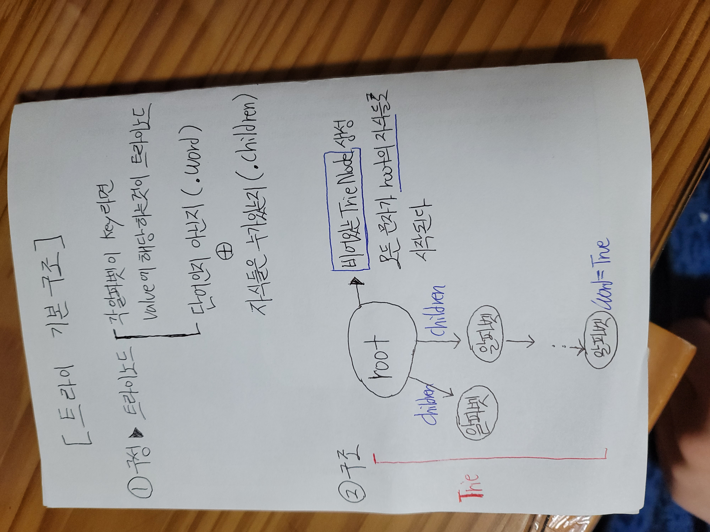
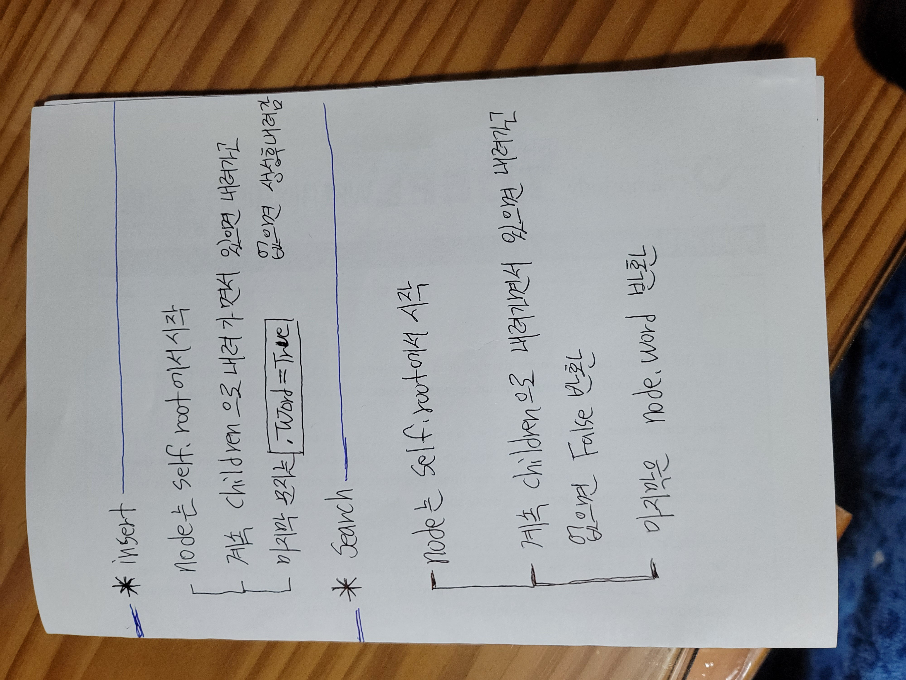

# 트라이 구현








```python
from collections import defaultdict

class TrieNode:
    def __init__(self):
        self.word = False
        self.children = defaultdict(TrieNode)

class Trie:

    def __init__(self):
        self.root = TrieNode()
        

    def insert(self, word: str) -> None:
        node = self.root
        for char in word:
            node = node.children[char]
        node.word = True
        

    def search(self, word: str) -> bool:
        node = self.root
        for char in word:
            if char not in node.children:
                return False
            node = node.children[char]
        return node.word
    

    def startsWith(self, prefix: str) -> bool:
        node = self.root
        for char in prefix:
            if char not in node.children:
                return False
            node = node.children[char]
        return True      
```

