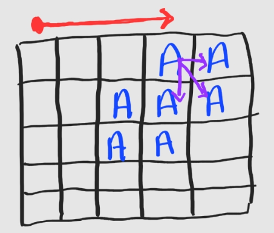

# 프랜즈 4블록

출처: https://programmers.co.kr/learn/courses/30/lessons/17679    


> 문제 및 입출력

출처 참고   


> 처음 시도 후 실패


[생각]

* 현재 주어진 맵상에서 **가능한 모든 부분을 찾고 한번에 뿅하고 블록을 제거**해야 한다는 것을 이해하는데 시간이 좀 걸렸다. 
  * 위 사실을 간과하고 **4칸이 되는 놈들을 발견 즉시 제거 및 맵 복구**를 하고 탐색을 계속 수행해나가려다가 이게 아님을 깨달았다.    


* 구현 로직은 다음과 같다.

  * **전체를 순회**하는데 **마지막 줄과 마지막 칼럼은 순회하지 않는다**.
    * 그 이유는 언제나 **해당 칼럼을 가장 좌상단의 칼럼**으로 인식하고 4칸 탐색을 할 것이기 때문이다.    

  

  * 현재 칼럼과 다음 칼럼의 문자가 같은 경우 **[4칸 탐색 함수]**가 작동한다. 
  * **[4칸 탐색 함수]**
    * 현재 좌표를 큐에 넣고 큐가 빌 때까지 4칸을 탐색한다.
    * 탐색 성공시 나머지 좌표들도 큐에 넣는다.
    * 큐에 넣는 모든 좌표들은 set에도 넣는다.
    * 탐색이 모두 종료되면 set 길이만큼 정답을 업데이트한다.
    * 또한 set에 있는 좌표의 값들을 0으로 바꿔준다.     

  

  * 전체 순회가 끝났으면 현재의 결과값이 순회전 결과값과 같은지 확인한다.
    * 다르면 **[맵 복구 함수]**를 수행하고 다시 위로 올라간다.
    * 같으면 결과값을 반환한다.     

  

  * **[맵 복구 함수]**
    * 각 열을 기준으로 아래부터 위로 탐색을 하면서 해당 값이 문자인 경우 포인터가 가리키는 위치와 바꿔준다.
    * 포인터는 가장 아래(n-1)의 위치부터 시작하고 스왑이 발생하면 하나씩 위로 올라간다(-=1)     

​     

* 코드

```python
def solution(m, n, board):
    res = 0
    
    # 해당 좌표를 좌상단으로 생각하고 4칸을 확인한다.
    # 4칸이 확인되면 탐색 대상에 넣는다 + loc_set에 넣는다.
    # (loc_set: 좌표 탐색이 끝나고 맵을 0으로 바꿔줄 기능)
    def check(r,c):
        character = board[r][c]
        c_list = [(r,c)]
        loc_set = set()
        while c_list:
            r,c = c_list.pop()
            if r == n-1 or c == m-1:
                continue
            else:
                if all(board[p][q] == character for p,q in ((r,c+1),(r+1,c),(r+1,c+1))):
                    c_list.extend([(r,c+1),(r+1,c),(r+1,c+1)])
                    loc_set.update(((r,c),(r,c+1),(r+1,c),(r+1,c+1)))

        for rr,cc in loc_set:
            board[rr][cc] = 0
        return len(loc_set)

    # 맵 복구 함수
    # 각 열을 기준으로 탐색 수행
    # 문자 발견시 포인터가 가리키는 곳과 스왑
    # (포인터: 가장 아래부분을 초기값으로 설정하고 스왑 발생시 한칸씩 올림)
    def restore_map():
        for col in range(m):
            p_row = n-1
            for row in range(n):
                if board[row][col] != 0:
                    board[row][col],board[p_row][col] = board[p_row][col],board[row][col]
                    p_row -= 1
        return
    
    # 전체 순회하는 메인 함수
    def check_all(res):
        while True:
            # 초기 res값을 기록(전체 순회후 변화 있는지 확인 용도)
            # 변화 없다면(맵에서 4칸 발견 못했다면) 함수 종료
            # 변화 있다면(맵에서 4칸 발견했고 없앴다면) 맵 복구후 다시 전체 탐색
            last = res
            loc_set = set()
            for i in range(n-1):
                for j in range(m):
                    if j == m-1:
                        continue
                    elif board[i][j]!= 0 and board[i][j] == board[i][j+1]:
                        res += check(i,j)
            if res != last:
                restore_map()
            else:
                return res
```

​    

* 실패 이유

  * 입력 변수 n과 m을 반대로 이해했다. 
    * 문제에서는 n을 column의 길이, m을 row의 길이로 주었다.
  * 위 풀이가 탐지하지 못하는 사각지대가 존재했다.

  
  * 우리는 빨간색의 방향과 순서로 탐색을 수행하고 4칸 발견시 맵을 0으로 만든다.

  * 하지만 위 경우와 같은 경우 아래에 있는 4블록은 위에서 탐지가 안되므로 그대로 남게 된다.

  * 그래서 이를 수정해줘야 한다.    

    ​     


> 두번째 시도 후 성공

* 그러면 위의 사각지대를 어떻게 해결할까에 대한 해답으로 두 가지를 생각했다.    


* 첫번째 방법은 위 방식을 그대로두고, 맵을 0으로 바꾸는 부분을 없애는 것이다. 
  * 그리고 4칸 탐색이 된 좌표들을 set에 계속 담아뒀다가 전체 탐색이 끝나고 나서 일괄적으로 0으로 바꿔주는 것이다.      


* 두번째 방법은 모든 좌표에 대해서 그냥 한번의 4칸 탐색을 수행하는 것이다.
  * 즉 4칸이 발견되면 그 4칸에 대해 또 4칸 검색을 연속적으로 수행하는 것이 아닌 그냥 한번의 4칸 검색을 하는 것이다.      


* 두 방식 중 두번째 방식으로 코드를 작성했고 이유는 다음과 같다.
  * 가장 큰 이유는 직관성이다.
    * 문제 상황을 모두 해결하는 가장 단순하고 직관적인 방식이라 구현도 쉽고 디버깅도 쉽다.
    * 하나의 섬세하지만 길이가 긴 함수를 작성하는 것은 굉장히 어렵고 오류발생 확률이 높다.
  * 또 다른 이유는 기존 방식을 그대로 사용하는 경우 반복해서 확인하는 경우가 생긴다는 것이다. 


* 코드는 다음과 같다.

```python
def solution(m, n, board):
  
  # 오직 해당 좌표 기준 4칸만 확인해주는 함수
  # 확인 후에는 좌표를 set에 담는다.
  def check(r,c):
    character = board[r][c]
    if all(board[p][q] == character for p,q in ((r,c+1),(r+1,c),(r+1,c+1))):
      loc_set.update(((r,c),(r,c+1),(r+1,c),(r+1,c+1)))
    return None

  # 맵 복원 함수
  def restore_map():
    for col in range(m):
      p_row = n-1
      for row in range(n-1,-1,-1):
        if board[row][col] != 0:
          board[row][col],board[p_row][col] = board[p_row][col],board[row][col]
          p_row -= 1
    return

  # m,n을 반대로 이해하고 코드를 작성했기에 서로 스왑해준다.
  m,n = n,m
  board = [list(line) for line in board]
  res = 0 
  while True:
    loc_set = set()
    for i in range(n-1):    # n-1번째 행은 4칸 탐색이 불가
      for j in range(m-1):  # m-1번째 열은 4칸 탐색이 불가 
        # 4칸 탐색 할만한 경우
        if board[i][j]!= 0 and board[i][j] == board[i][j+1]:
          check(i,j)
        
    # 4칸이 발견된 적이 있다면 0으로 만들고 맵복구 작업 수행
    if loc_set:
      for r,c in loc_set:
        board[r][c] = 0
        res += 1
      restore_map()
    # 4칸이 발견 안됐으면 결과값 반환
    else:
      return res
```

​    

​    


> 성공후에 오는것들(즉 배운점)

* 문제를 읽으면(특히 긴 길이의 문제) 일단 예외 상황에 대한 처리를 생각하게 된다.
* 즉, 풀이 방식을 고민할 때 하나의 완전한 풀이법(예외상황을 알아서 처리하는)을 생각한다. 
* 나 역시 처음에 4칸 탐색을 반복적으로 수행하는 check 함수를 구현했다.
  * 매번 4칸을 탐색하고 탐색 성공시 다시 해당 4칸에 대해 또 탐색하는 방식이었다.
  * 탐색 방향은 해당 칸을 좌상단으로 놓고 다른 3칸을 탐색하는 것이다. 
* 하지만 이렇게 푼 결과 예외상황이 발생했다(위의 그림과 같은 상황)    


* 그래서 문제 풀이를 하루 쉬다가 씻으면서 단순한 방식을 떠올렸다.
* 모든 좌표에 대해서 그냥 4칸만 확인하는 방식이었다. 
* 이 방식으로 하면 예외상황이 생길 수 없고 또 매우 간단하기 때문에 구현도 디버깅도 쉬웠다.
  * 단지 브루드 포스라는 것이 좀 걸렸지만 어짜피 원래 풀이도 브루드 포스였다.
* 이렇게 푸니까 코드 길이도 짧아지고 아주 간단하게 구현이 가능했다.     


## [결론]

* **복잡한 문제일수록 단순한 기능을 구현해놓고 반복해서 푼다.**    


* **기능을 구현하면서 예외상황을 기능에서 처리하려고 하지말자.**    


* **기능은 기능만 구현하고 해당 기능을 사용하는 방식(예시:순회방식)에서 예외상황을 처리하자.**    


* **일단 가장 단순한 기능부터 구현하는것이 좋다.**