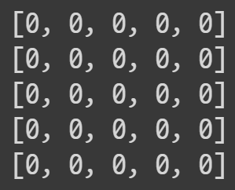
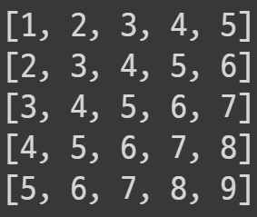

## 대각선으로 순회하기 

> 내용

2차원 배열을 대각선으로 순회하는 방법은 예시 문제를 통해 이해해본다.

​    

​     


> 문제 

* `0`으로 초기화된 2차열 배열(`n*m크기`)을 아래와 같은 형태로 만드는 코드를 작성한다.



* 대각선 형태로 `1`부터 `9`까지 넣어주는 코드를 작성한다.



​     

​     


> 코드

```python
n,m = 5,5  
map_ = [[0]*m for _ in range(n)]

for line in range(n+m-1): ## 대각선 (0,1,2,...,7,8)
  for i in range(n): ## 행 (0,1,2,3,4)
    column_ = line-i ## 열 (대각선-행)
    # 열의 값이 유효한 경우
    if 0 <= column_ < m:
      # line을 1부터 입력하기 위해 line+1을 해준다.
      map_[i][column_] = line+1

print(*map_ ,sep = '\n')
```

​    

> 코드 설명

* 각 대각선에 속하는 셀(cell)의 좌표를 정리해서 규칙성을 파악한다.

  | 대각선 번호 | 좌표                            |
  | ----------- | ------------------------------- |
  | 1           | [(0,0)]                         |
  | 2           | [(0,1),(1,0)]                   |
  | 3           | [(0,2),(1,1),(2,0)]             |
  | 4           | [(0,3),(1,2),(2,1),(3,0)]       |
  | 5           | [(0,4),(1,3),(2,2),(3,1),(4,0)] |
  | 6           | [(1,4),(2,3),(3,2),(4,1)]       |
  | 7           | [(2,4),(3,3),(4,2)]             |
  | 8           | [(3,4),(4,3)]                   |
  | 9           | [(4,4)]                         |

* `각 대각선 숫자 - 1`에서 `각 행번호`를 뺀 것이 해당 행의 `열번호`가 된다. 
  * `3번 대각선`을 예로들면 `0번` 행은 `3-1-0`인 `2`가 열번호가 된다. `(0,2)` 
  * `1번`행의 경우 `3-1-1`인 `1`이 열번호가 된다. `(1,1)`
  * `2번`행의 경우 `3-1-2`인 `0`이 열번호가 된다. `(2,0)`

* 가장 상위의 순회 조건은 대각선 숫자 기준으로 수행한다.
* 대각선 기준으로 각각의 행에 해당 대각선의 요소가 들어갈 자리가 있는지 확인한다. 
  * 이 때 확인을 위해서는 `대각선 숫자 - 행 번호`를 이용한다.
  * `대각선 숫자 - 행 번호`는 또한 `열 번호`가 된다. 

