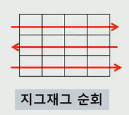

## 지그재그로 순회하기

* 2차원 리스트를 **지그재그 방식**으로 순회해보자



```python
for i in range(len(Array)):
    for j in range(len(Array[0])):
        Array[i][j+(m-1-2*j)*(i%2)]
```

* `i%2`는 `0` 아니면 `1`이 나온다. (짝수행이면 `0`, 홀수행이면 `1`)
  * `0`이 나오면 곱하기로 연결된 부분 전체가 `0`이 된다
  * `1`이 나오면 곱하기로 연결된 부분은 `(m-1-2*j)`이 된다.
    * `m`: 칼럼의 갯수
    * `m-1`: 가장 마지막 칼럼의 인덱스
    * `m`이 `4`인 경우, `m-1-j`는 `3-0(=3)` , `3-1(=2)` , `3-2(=1)` , `3-3(=0)`이 된다.
      * `3`,`2`,`1`,`0` 순서대로 순회하는 경우 뒤에서부터 순회가 가능
      * 그런데 식 앞에 `j+`가 있기 때문에 이를 상쇄시키기 위해서 `-j`를 또 넣은 것이다.

​     

​    


## `Array[i][j+(m-1-2*j)*(i%2)]`