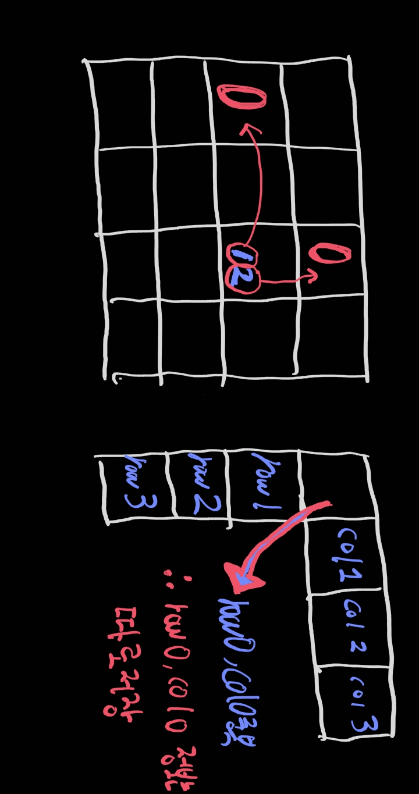

# 테이블을 0으로 세팅하기

from: https://leetcode.com/problems/set-matrix-zeroes/


### 풀이



* 각 `cell`을 순회하면서 `0`인 경우 해당 위치의 `row`와 `col`이 `0`이 될 수 있도록 데이터를 기록해야 한다.

* 이 기록을 위해 따로 `table`이나 `array`를 만들 수 도 있지만 문제 조건상 `in place` 방식으로 해야 하기에 주어진 `matrix`를 이용한다. 

  * `in place` 방식으로 데이터 변경을 수행하기 위해서 `matrix` 내부의 공간을 사용해서 기록

* `row`에 대한 기록: 해당 `row`의 첫 번째 인자를 `0`으로 세팅함으로서 기록한다.

* `col`에 대한 기록: 첫 `row`의 해당 번째 인자를 `0`으로 세팅함으로서 기록한다.

* 위 방식으로 기록하는 경우 그림과 같이 각 `row`와 `col`은 다른 공간에 기록된다.

  (단, `0`번째 `row`, `col`은 아니다.)

* 첫번째 `row`와 `col` 에 대한 기록(정보)는 따로 저장한다.


### 코드

```python
class Solution:
    def setZeroes(self, matrix: List[List[int]]) -> None:
        # 첫번재 row와 col에 대한 기록을 담을 변수
        isFirstRow0 = False
        isFirstCol0 = False
        
        # first row check
        for i in range(len(matrix[0])):
            if matrix[0][i] == 0:
                isFirstRow0 = True
                # 해당 col에 대한 정보는 첫번째 row의 해당 번재 인자에 기록
                matrix[0][i] = 0
                
        # first col check
        for i in range(len(matrix)):
            if matrix[i][0] == 0:
                isFirstCol0 = True
                # 해당 row에 대한 정보는 해당번째 row의 첫 번째 인자에 기록
                matrix[i][0] = 0
        
        # check rest of all 
        for i in range(1,len(matrix)):
            for j in range(1,len(matrix[0])):
                if matrix[i][j] == 0:
                    # row의 경우 각 row의 첫번째 인자를 0으로 세팅
                    # col의 경우 첫 row의 해당 번째 인자를 0으로 세팅
                    matrix[i][0] = 0
                    matrix[0][j] = 0
                    
        # lets complete the transition
        # row
        for i in range(1,len(matrix)):
            if matrix[i][0] == 0:
                for j in range(len(matrix[0])):
                    matrix[i][j] = 0
        # col
        for i in range(1,len(matrix[0])):
            if matrix[0][i] == 0:
                for j in range(len(matrix)):
                    matrix[j][i] = 0
        
        # first row
        if isFirstRow0:
            for i in range(len(matrix[0])):
                matrix[0][i] = 0
        
        # first col
        if isFirstCol0:
            for i in range(len(matrix)):
                matrix[i][0] = 0
```

