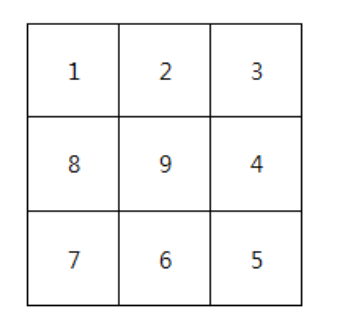
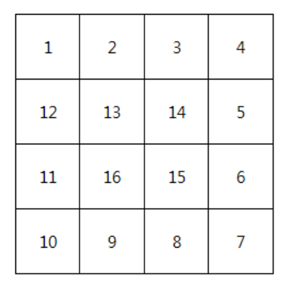

## 달팽이 배열 만들기


> 문제

1이상의 정수 n이 주어질 때, 달팽이 모양의 배열을 만들어라.


> 입력과 출력 예시

n = 3



n = 4



​    

   

> 나의 코드

```python
# 다음 좌표에 갈 수 있는지 확인하는 함수 
def check_next_pos(r,c):
    if all([0 <= x < n for x in (r,c)]) and (not map_[r][c]):
        return True
    return False 
 
# 이동방향을 바꿔야 할 때, 가능한 방향을 알려주는 함수
def finding_direction(r,c):
    for idx in range(4):
        nr,nc = r+mr[idx],c+mc[idx]
        if check_next_pos(nr,nc):
            return nr,nc,idx
    return -1,-1,-1  
 
 
 
def dfs(r,c,dir,cur):
    # 현재 좌표에 값을 넣는다
    map_[r][c] = cur
     
    # 이동할 다음 좌표값 생성
    nr,nc = r+mr[dir],c+mc[dir]
     
    # 이동할 수 있으면 이동
    if check_next_pos(nr,nc):
        dfs(nr,nc,dir,cur+1)
         
    # 이동할 수 없다면 다른 이동 방향 검색
    else:
        nr,nc,next_dir = finding_direction(r,c)
        # 다른 방향이 가능한경우, 방향 바꿔서 이동
        if next_dir >= 0:
            dfs(nr,nc,next_dir,cur+1)
 
T = int(input())
for test_case in range(1, T + 1):
    n = int(input())
    map_ = [[0]*n for _ in range(n)]
    mr = [0,1,0,-1]
    mc = [1,0,-1,0]
    dfs(0,0,0,1)
    print(f"#{test_case}")
    for line in map_:
        print(" ".join(list(map(str,line))))
```


> 다른 코드 ★★★

```python
def Snail_Sort(N):
    # N x N 배열 초기화
    arr = [[0]*N for _ in range(N)]
    # 처음 위치 초기화
    x = 0
    y = -1  # ★y좌표의 값을 -1로 하면 시작좌표인 0,0부터 확인 작업을 할 수 있다.
    # 방향 초기화
    po = 1
    value = 1
    # N은 입력 배열의 크기이면서 각각의 순회시 입력하는 값의 갯수로 사용된다.
    while N > 0:
        # 행 채우기
        for i in range(N):
            y += 1 * po  # ★★★po라는 변수를 사용해서 채워지는 방향을 결정한다.
            arr[x][y] = value
            value += 1
        # 한 칸 줄이기
        N -= 1
        # 열 채우기
        for i in range(N):
            x += 1* po
            arr[x][y] = value
            value += 1
        # 방향 반대로
        po *= -1
    return arr
```

​    

​    

> 코드 설명

* 일단 규칙성을 발견한 것이 인상적이다. 벽이나 이전에 입력된 값을 만나면 방향을 돌려서 채워나가는 문제에서 조건식이 아닌 규칙성을 찾아서 풀었다는게 인상적이다.
* `po`라는 변수를 사용해서 채워나가는 방향을 바꾼 것도 생각해보지 못한 부분이다. row나 column을 가리키는 변수에 `1` 혹은 `-1`값을 가진 변수 `po`를 사용해서 방향을 바꾼 것이 재미있다.
* 초기 시작 위치를 `(0,0)`이 아닌 `(0,-1)`로 설정한 경우, 시작 위치`(0,0)`부터 이동할 수 있는 좌표인지 확인 작업이 가능하다.
  * 반복문 만들기 수월


> 정답 코드 ★★★★

```python
di = [0,1,0,-1]
dj = [1,0,-1,0]

n = int(input())
arr = [[0]*n for _ in range(n)]
# m: 입력할 숫자, k: 방향값, i:row값, j:column값(초기위치 -1로)
m = 0 
k = 0
i = 0
j = -1
#1
while m<n*n: # 남은 칸이 있다면
    ni,nj = i +di[k], j+dj[k]
    if 0<=ni<n and 0<=nj<n and arr[ni][nj] == 0:#다음칸이 유효하고 값이 0이면(이동가능)
        i = ni
        j = nj
        m += 1 #다음칸에 기록할 숫자 업데이트
        arr[i][j] = m
    #2
    else:
        k = (k+1)%4 # ★★★ 단순하게 방향 바꾸기 가능 !!! ★★★
```

​    

> 코드 설명

* **#1** 입력값 `m`과 `n*n`을 사용해서  `while`문의 조건을 만들었다.
  * 우리가 입력해야 하는 값은 `1`부터 `n*n`이다.
  *  `m`은 이전에 입력한 값이기에 `m`이 `n*n` 이 되었다는 것은 이미 `n*n`이 입력되었음을 의미한다.
  * 이렇게 `m`을 활용하기 위해 `m`의 초기값을 `0`으로, 좌표 초기값을 `(0,-1)`로 했다는 걸 인식하자.

* #**2** 방향값을 쉽게 업데이트 할 수 있다.

  * 이동하다가 방향을 바꿔야 하는 순간이 오면 바로 `(k+1)%4`를 통해 방향값을 업데이트 할 수 있다.

    