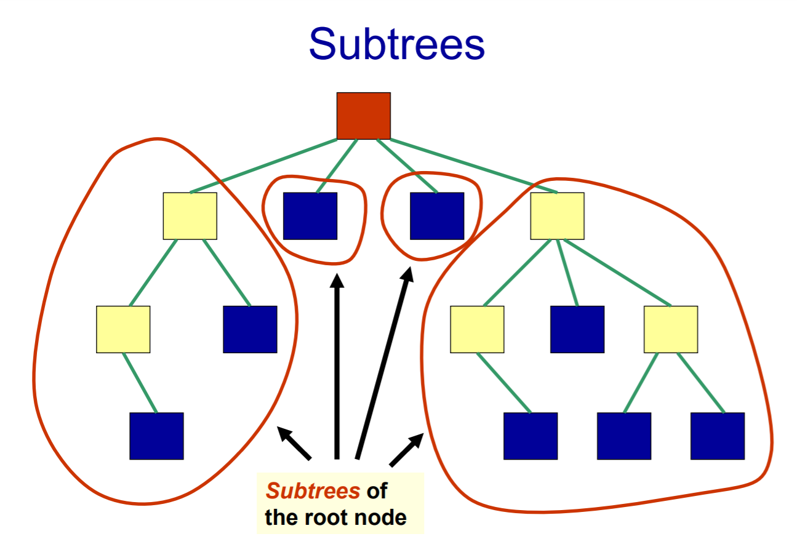
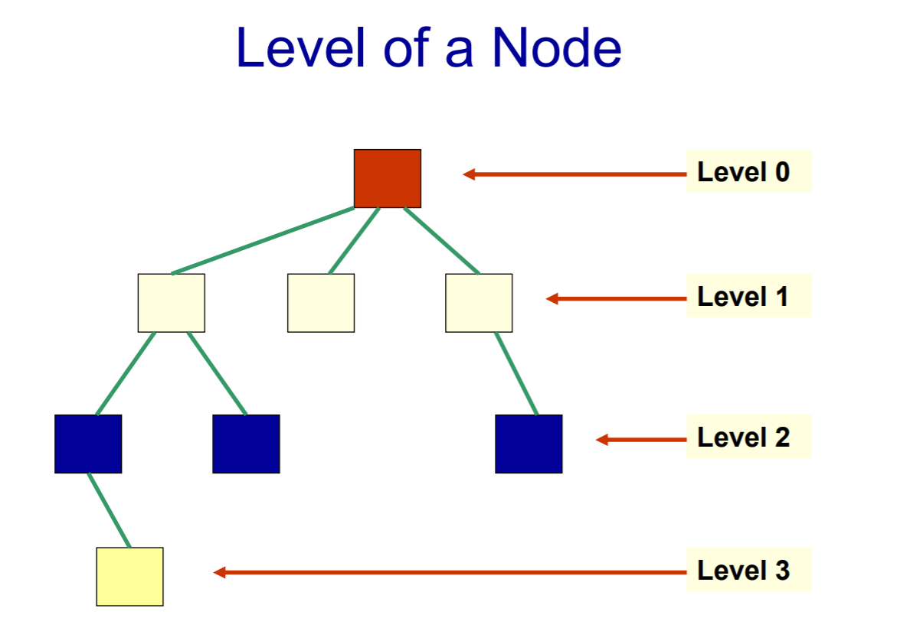
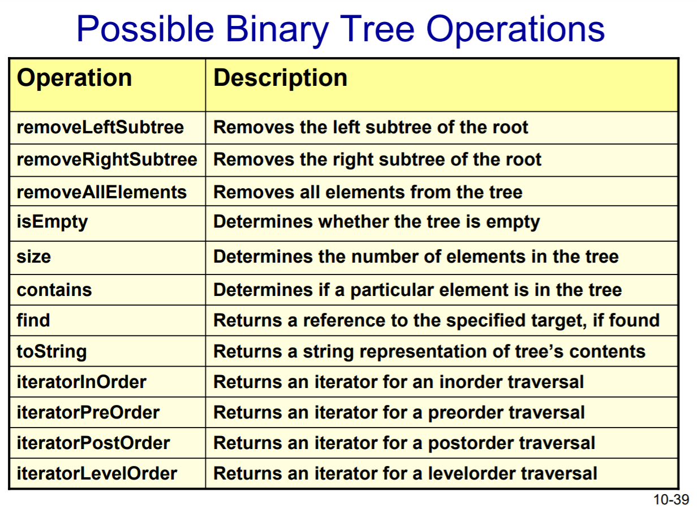

# 트리

> 정의

비선형자료구조 중 하나로 개체(Entity or Node)들의 위계적인 관계를 나타낸 자료구조이다.

(같은 트리 내의 모든 개체(노드)들은 같은 type의 자료이다.)    


> 용어

root: 트리가 시작되는 개체(노드)를 뜻한다. 

subtree: root 아래에 존재하는 1개 이상의 개체(노드)를 임의대로 묶은 것을 subtree라고 부른다.

leafnode: 자식이 없는 개체(노드)들을 leaf node라고 부른다.(leaf들의 level(계층)은 다를 수 있다.)

interior node: root와 leaf 사이에 있는 개체(노드)들을 interior node라고 부른다. 

edge: 개체(노드)사이의 연결

empty tree: 노드와 엣지가 없는 트리

parent(or predecessor): 바로 위에 연결된 노드(부모노드)

child(or successor): 바로 아래 연결된 노드(자식노드)

siblings: 같은 부모로부터 뻗어나온 형제 노드

ancestors: 부모를 포함한 상위 노드들(조상노드)

descendants: 자식을 포함한 하위 노드(자손노드)     



​     


> 트리의 높이

* path는 어떤 노드에서 다른 노드로 가는 경로를 의미한다.

* length of a path:  path에 존재하는 연결(edge)의 갯수

* height of a tree: root에서 가장 멀리 떨어진 leaf까지의 length of path를 뜻한다.
  (=root에서 가장 멀리 떨어진 leaf까지 **몇개의 연결선이 존재**하는지)

  * By convention, the height of an empty tree is -1     

    

    

> 노드의 레벨

* level of a node는 root와 node사이의 연결(edge)의 갯수를 의미한다.
  * level of a node는 재귀적으로 정의가 가능하다.
    * root의 level of a node는 1이다.
    * root 노드가 아닌 노드의 level은 부모노드의 level +1이다.



​      


> 트리의 종류 

1. General Tree: 자식 노드 갯수 제한이 없는 트리
2. n-ary Tree: n개 이하의 자식 노드만 가진 트리
3. Binary Tree: 2개 이하의 자식 노드만 가진 트리
   * 각각의 자식 노드는 left child 와 right child라고 불린다.


> 트리 순회 (Tree Traversal)

* 트리의 순회 시 각각의 노드를 반드시 한번만 방문해야 한다.
  * 트리 순회의 일반적인 목적은 트리 구조에 저장된 데이터를 확인하는 것이다.
  * 따라서 트리 순회시 각 노드들을 한번만 방문해서 원하는 지점으로 가는게 중요하다.

* 트리 순회의 방식(순서)

  * '전위', '중위', '후위'는 root노드를 기준으로 붙여진 명칭이다.

  1. preorder (전위)

     * node - left child - right child 순서로 탐색

     * 대상 노드 방문 - left child 노드 순회 시작 - right 노드 child 순회시작

  2. inorder (중위)

     * left child - node - right child 순서로 탐색

  3. postorder(후위)

     * left child - right child - node 순서로 탐색

  4. level-order

     * 각 계층의 노드들을 왼쪽에서 오른쪽의 방향으로 탐색하고 다음 계층으로 넘어간다.


> 트리 순회의 pseudo code

```
방문할 node들을 담을 container를 생성한다.

root 노드를 container에 넣는다.

while container is not empty:
	container에서 노드 하나를 꺼낸다.
	(꺼낸 노드의 값을 확인하던지 작업을 수행한다)
	해당 노드의 자식들 중 empty가 아닌 노드를 container에 넣는다.
```

​     


> stack이 container가 되는 경우 vs queue가 container가 되는 경우 

* stack이 container가 되고 우리가 right child → left child 순서로 넣는 경우, preorder방식이 된다.
  * `[rightchild , leftchild]`에서 `pop`하면 `left child`가 나온다.
  * `left child의 right child` , `left child의 left child`가 다시 `stack`에 쌓인다.  
  * 결국 `노드` - `left child` - `right child` 순서로 순회하게 된다. 
  * 이는 전위 순회 방식이다.
* queue가 container가 되고 left child →  right child 순서로 넣는 경우 level order 방식이 된다.
  * [left child, right child]에서 popleft를 통해 추출하기에 level 순서대로 탐색하게 된다.


**"다음에 방문할 노드들을 담아둘 container로 어떤 자료구조를 사용할지에 따라 탐색방식이 변한다."**


> 이진 트리 탐색의 시간 복잡도는?

* binary tree가 n개의 노드를 가지고 있다고 생각해보자
* 각각의 노드는 2번의 재귀 호출(recursive call)을 수행한다(left child, right child)
* 따라서 전체 binary tree의 재귀 호출(recursive call)은 최대 2*n번 수행된다.
* **[결론] 이진트리 탐색의 시간 복잡도는 O(n)이다.**     


> 이진트리의 Operation (ADT)

###### ADT: Abstract data type

1. **Add** an element (where?)
2. **Remove** an element (from where?)
3. **Is the tree empty?**
4. **Get size** of the tree(i.e. how many element)
5. **Traverse** the tree(in preorder, inorder, postorder, level order)

  

※ 유의사항

◆ Add의 경우 다양한 방식이 존재하기에 tree의 (사용)목적에 따라 구현해야 한다.

지금은 그냥 tree 자료구조를 구현해보는 연습을 하는 것이기에 randomly한 방식의 add를 구현한다.

(=left chlid든 right child든 상관없이 가장 먼저 add할 수 있는 spot에 넣는 방식으로 구현)

​     

◆ 마찬가지로 remove 역시 tree의 사용 목적에 따라 구현해야 한다. 

remove 역시 왼쪽기준으로 가장 먼 leaf부터 삭제하는 등의 방식을 정해서 구현한다.




   


---

참고자료

https://www.csd.uwo.ca/Courses/CS1027b/notes/CS1027-014-Trees-W12.pdf

https://www.tutorialspoint.com/python_data_structure/python_binary_tree.htm

https://pitachips.tistory.com/72