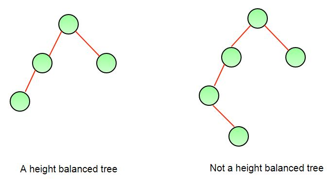

## Height Balanced Binary Tree를 판별하는 방법

출처: https://www.geeksforgeeks.org/how-to-determine-if-a-binary-tree-is-balanced/    

> Height Balanced Binary Tree란?

* 높이균형 이진트리(Height Balanced Binary Tree)는 트리의 모든 leaf가 root로부터의 거리가 동일한 이진트리를 의미한다.
* 높이균형 이진트리가 되려면 다음과 같은 조건을 만족해야 한다.
  (empty binary tree는 무조건 높이균형 이진트리다)
  1. Left Subtree가 Height Balanced Binary Tree여야 한다.
  2. Right Subtree가 Height Balanced Binary Tree여야 한다.
  3. Left Subtree와 Right Subtree의 높이 차이가 1이하여야 한다.(1은 괜찮고 2부터 안된다)     

* 왼쪽의 경우 Left Subtree와 Right Subtree의 높이차가 1이라 Height Balanced Binary Tree가 된다.
  (오른쪽은 차이값이 2라서 안된다)

