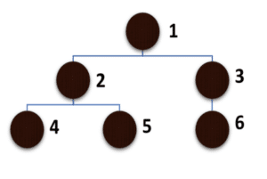
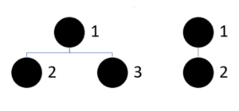

# 트리와 포레스트

출처: https://magoosh.com/data-science/what-is-forest-data-structure/#:~:text=In%20a%20tree%2C%20the%20data,t%20be%20connected%20to%20A.    

​       

포레스트라는 데이터 유형은 데이터 사이언스 분야에서 주로 사용됩니다. 포레스트에 대해 알아보기 전에 트리와 그래프에 대한 기본적인 이해가 필요합니다.       

## 그래프

그래프는 다른 노드와 연결되어 있는 노드들의 집합입니다. 페이스북을 떠올리면  그래프 형태를 이해하기 쉽습니다. 페이스북 사용자는 다른 사용자들과 연결되어 있습니다. 그래프는 0개 이상의 사이클을 포함할 수 있습니다.       

​       

## 트리

트리는 그래프와 함께 비선형 자료구조의 한 유형입니다. 좀 더 자세히 말하자면 트리는 그래프에 속해있는 자료구조로 사이클이 없는 그래프를 의미합니다.       

​       

## 선형 데이터 구조

선형 데이터 구조는 선형의 순서로 데이터를 저장하는 방식을 자료구조로 배열과 연결리스트가 대표적입니다.      

​       

## 비선형 데이터 구조

비선형 데이터 구조는 비선형의 순서로 데이터를 저장하는 방식의 자료구조를 의미합니다. 
아래 그림은 트리 자료구조의 한 예시 입니다. 

위 트리는 이진트리라고 불리는데, 각 노드는 최대 2개까지의 자식 노드를 가지고 있기 때문입니다.     

​     

## 포레스트

포레스트는 독립적인 트리들의 집합입니다.다시 말하면 서로 연결되어 있지 않은 사이클이 없는 그래프(트리)들의 컬렉션을 포레스트라고 할 수 있습니다.  아래 그림은 포레스트의 예시 입니다.

