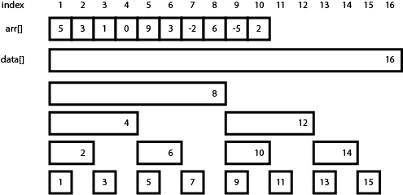

# 펜윅트리

출처: https://greeksharifa.github.io/algorithm%20&%20data%20structure/2018/07/09/algorithm-fenwick-tree/


# 기본적인 내용

* 펜윅트리는 부분합을 담고 있는 배열이다.
  * 개념상 구조는 트리구조지만 실제 구현은 배열의 형태로 한다. 
* 트리의 인덱스 값을 이진수로 변환했을 때, 마지막 1이 위치한 곳의 숫자만큼의 요소 갯수를 포함한 합이된다. 
  * 해당 숫자만큼 순회하면서 이진수에서 -1을 해준 값을 포함한다.
  * 인덱스가 홀수인 원소는 수열의 해당 인덱스의 값을 그대로 가진다


# 구간합 구하기

1번 요소부터 7번 요소의 합을 구하기

* 7을 이진수로 바꾸면 111으로 1씩 떼면서 해당 값을 더해준다.
  * `tree[7](111) + tree[6](110) + tree[4](100) `
* 그러면 위의 값이 1부터 7번 요소의 합인지 확인해보자.


* tree[7]은 7번요소의 합
* tree[6]은 5,6번 요소의 합
* tree[4]는 1,2,3,4번 요소의 합


### 그렇다면 4부터 12까지의 합은 어떻게 구할까?

* 1부터 12까지의 합에서 1부터 3까지의 합을 빼주면 된다.


# 값을 업데이트 해보자

7번요소의 값을 업데이트했다면, 7번 요소를 품은 값들을 모두 업데이트해줘야한다.


### 7번요소를 품은 값을에는 무엇이 있을까?

7번요소를 품은 값들은 계속해서 마지막에 오는 1의  값을 더해준 것들이다. 

예를 들면 7은 이진수로 111이다.

111 + 001은 1000으로 8이 된다.

1000 + 1000은 10000으로 16이된다.

즉, 7번 요소를 수정했을 때, 같이 수정해줘야 하는 값들은 8번값과 16번 값이 된다.

그림을 통해서 확인해보자.



* 7번요소에서 위로 수직선을 그으면 만나는 것은 8번과 16번이다. 


# 펜윅트리의 기타 특징

* arr[i] = sum[i] - sum[i-1]임을 이용하면 arr배열을 유지할 필요가 없다


# 펜윅트리 구현

```python
arr = [0,5,3,1,0,9,3,-2,6,-5,2,0,0,0,0,0,0,0]  # 전체합: 22

tree = [0] * 17

for i in range(1,17):
  count = i&-i
  ni = i
  for _ in range(count):
    tree[i] += arr[ni]
    ni -= 1
  
tree
"""
결과값: [0, 5, 8, 1, 9, 9, 12, -2, 25, -5, -3, 0, -3, 0, 0, 0, 22]
"""
```

